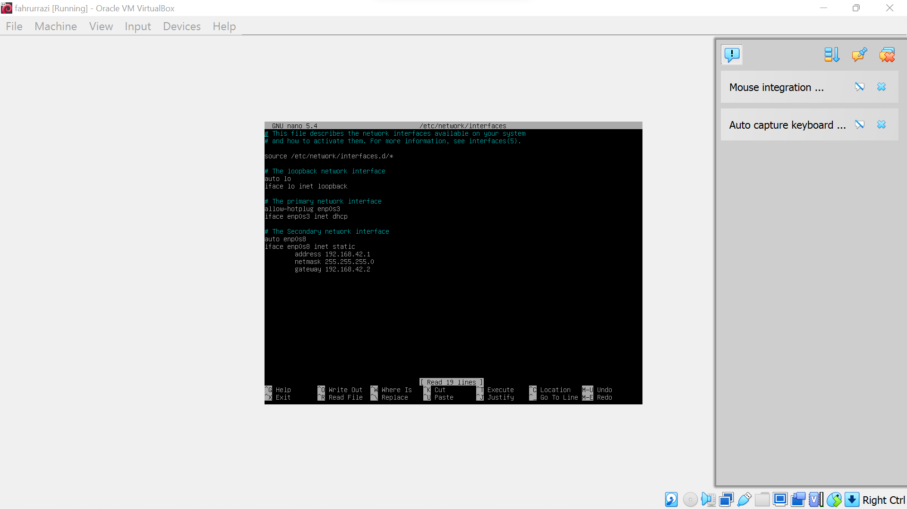
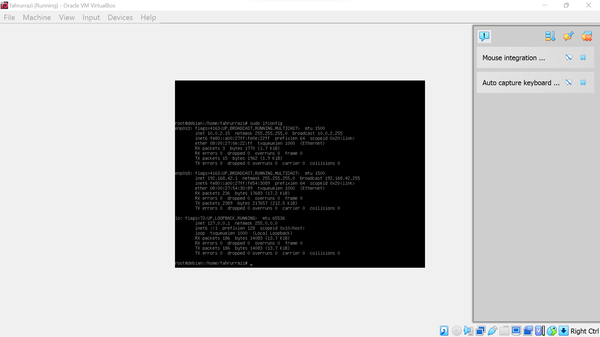
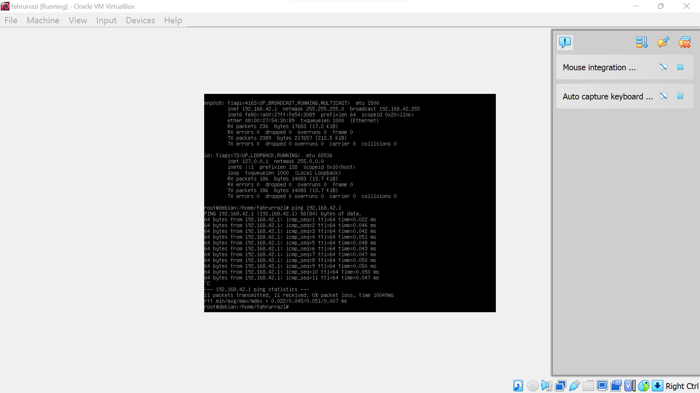
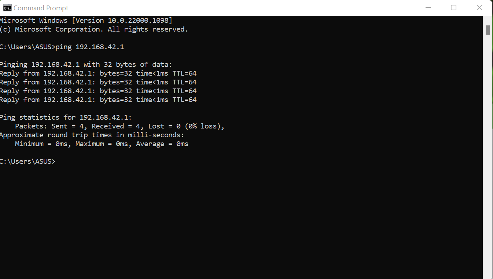

# client-server
---
## langkah-langkah nya sebagai berikut
---
## Nama Kelompok
1. Fahrurrazi 
2. Rizky Ahmad
3. Fahrul Ikhsan Hidayatullah
---
**pertama**
---
install terlebih dahulu network manager dengan net tools, perintah nya yaitu *apt install network-manager* dan *apt install net-tools* 

---
**kedua**
---
kemudian atur ip address dengan mengetikan *nano /etc/network/interfaces* kemudian atur dengan konfigurasi seperti pada gambar berikut untuk ip address yang utama enp0s3 dan untuk ip yang akan di ping menggunakan enp0s8.

---
**ketiga**
---
kemudian restart jaringan dengan menggunakan *systemctl restart networking* dan *systemctl restart networking.service* untuk memulai ulang konfigurasi agar bisa mengubah ip yang telah di edit tadi.

---
**keempat**
---
lalu lihat alamat ip yang sudah di restart dengan mengetikan perintah *sudo ifconfig* seperti pada gambar dibawah.

---
**kelima**
---
lakukan ping ip pada linux dengan mengetikan perintah *ping 192.168.42.1* untuk memanggil ip jika berhasil maka akan muncul tampilan sebagai berikut.

---
**keenam**
---
lalu coba lakukan ping pada windows jika berhasil maka akan muncul tampilan sebagai berikut.

