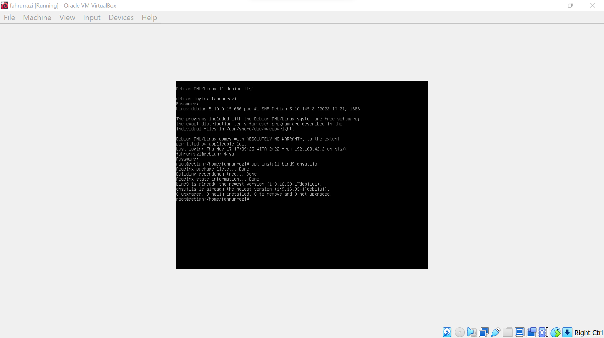
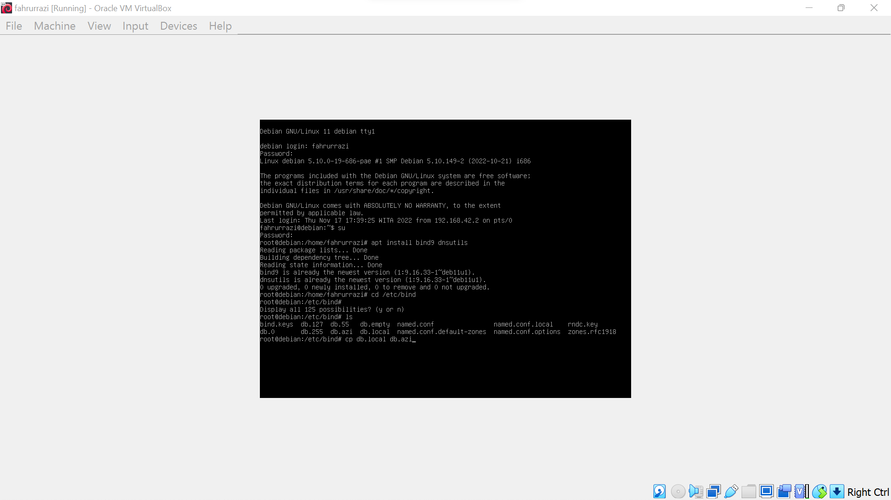
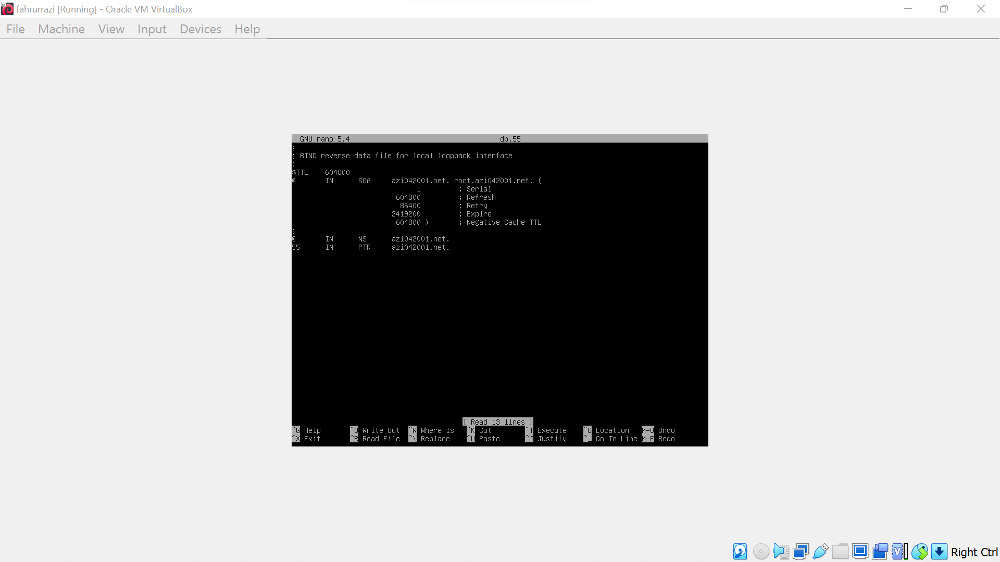
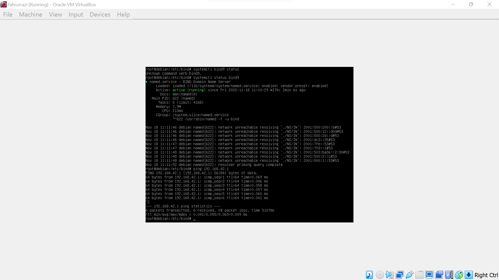
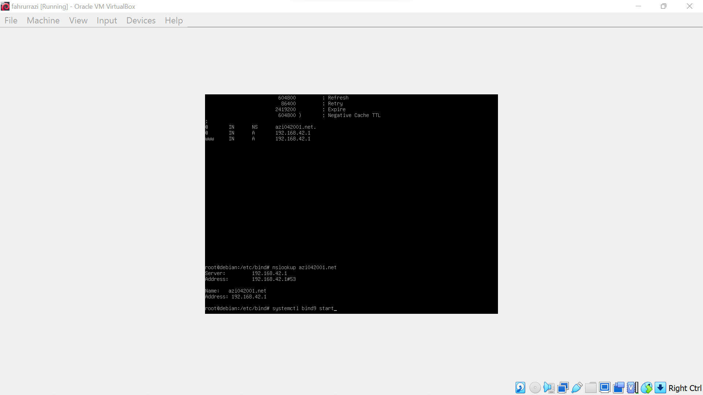

# DNS
---
## langkah-langkah nya sebagai berikut
---
## Nama Kelompok
1. Fahrurrazi 
2. Rizky Ahmad
3. Fahrul Ikhsan Hidayatullah
---
**pertama**
---
install dns terlebih dahulu dengan mengetikan perintah *apt install bind9 dnsutils* setelah itu akan muncul tampilan sebagai berikut.

---
**kedua**
---
setelah melakukan instalasi masuk ke dalam folder bind9 dengan mengetikan perintah *cd /etc/bind* dan lihat list file dengan mengetikan perintah *ls* setelah itu baru akan muncul hasil seperti digambar.

---
**ketiga**
---
copy folder dari db local ke db azi dan dari db 127 ke db 55 dengan cara mengetikan perintah *cp db local db azi* dan *cp db 127 db 55* setelah selesai maka akan muncul hasil seperti pada gambar berikut.

---
**keempat**
---
langkah selanjut nya tinggal melakukan konfigurasi seperti gambar dibawah dengan cara mengetikan perintah *nano db azi* dan *nano db 55* hingga mendapat hasil sebagai berikut.

---
**kelima**
---
langkah kelima kita tinggal mengaktifkan bind9 nya dengan cara mengetikan perintah *systemctl start bind9*.

---
**keenam**
---
langkah ke enam jika sudah selesai maka kita bisa mencari alamat dns dengan cara mengetikan perintah *nslookup azi042001.net*.

