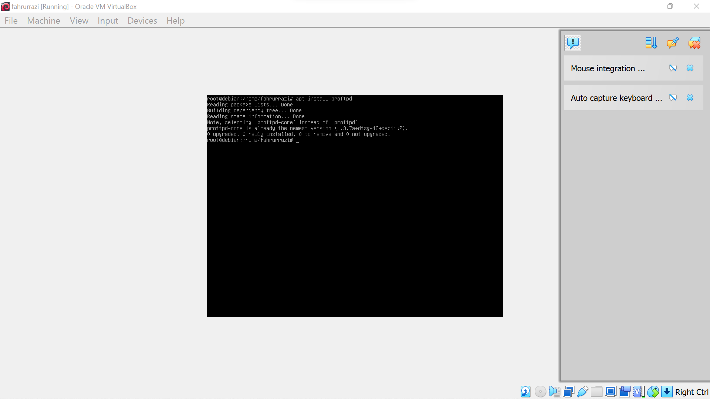
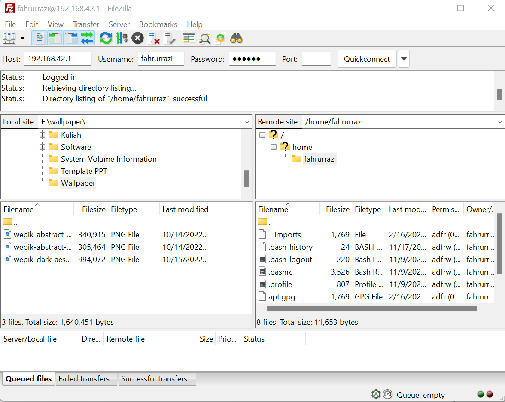
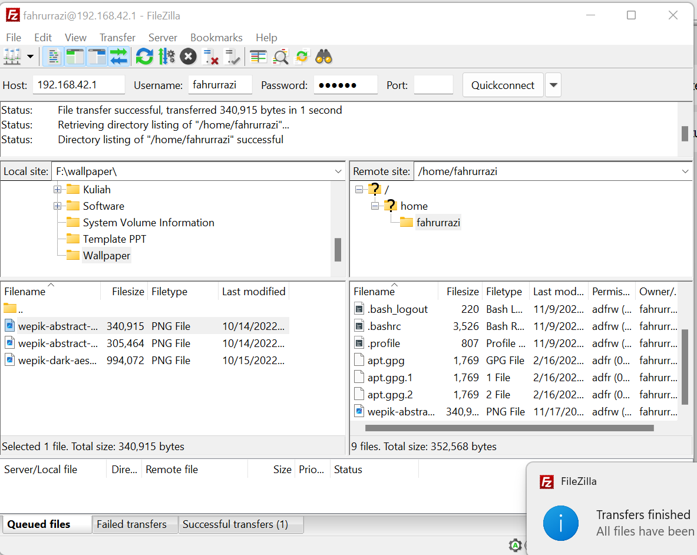

# FTP
---
## langkah-langkah nya sebagai berikut
---
## Nama Kelompok
1. Fahrurrazi 
2. Rizky Ahmad
3. Fahrul Ikhsan Hidayatullah
---
**pertama**
---
pertama install terlebih proftpd dengan cara mengetikan *apt install proftpd* jika sudah akan muncul hasil sebagai berikut.

---
**kedua**
---
kedua buka file zilla dan masukan host,username, password debian pada linux dengan port 22.

---
**ketiga**
---
kemudian coba pindahkan file dari komputer ke debian linux jika sudah berhasil maka akan muncul hasil sebagai berikut.

