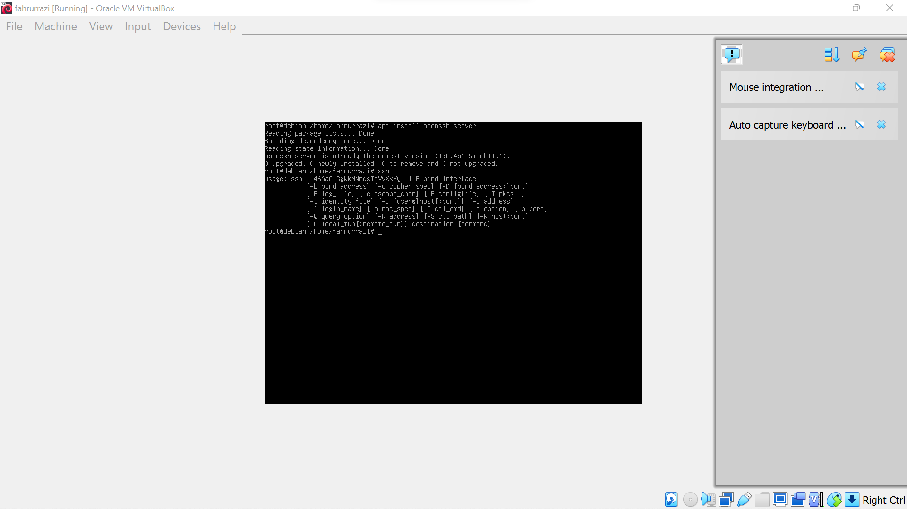
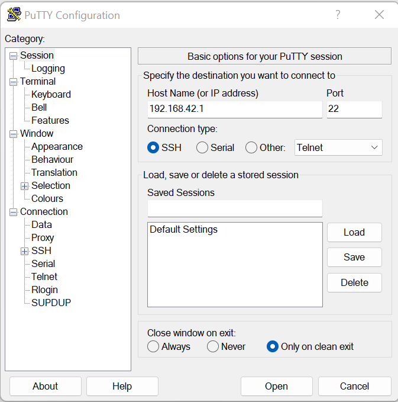
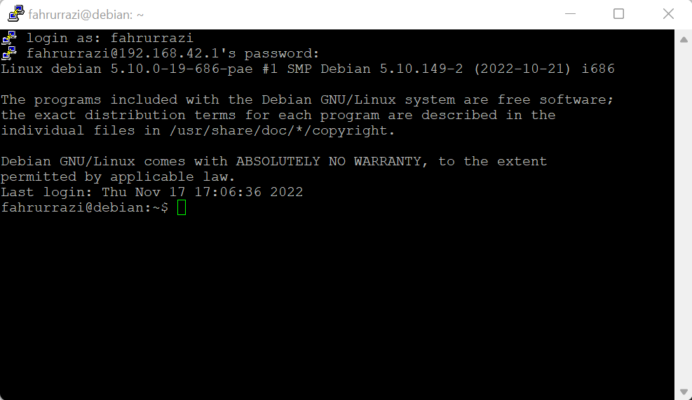
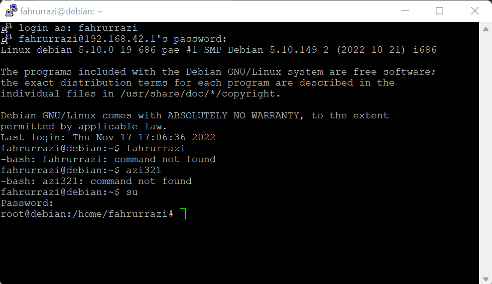

# SSH
---
## langkah-langkah nya sebagai berikut
---
## Nama Kelompok
1. Fahrurrazi 
2. Rizky Ahmad
3. Fahrul Ikhsan Hidayatullah
---
**pertama**
---
lakukan instalasi ssh terlebih dahulu dengan mengetikan *apt install openssh-server* dan cek apakah ssh sudah terinstall terlebih dahulu dengan mengetikan *ssh*

---
**kedua**
---
setelah selesai buka putty dan masukan ip address yang ada di debian anda untuk masuk ke server nya disini ip address nya yaitu *192.168.42.1* 

---
**ketiga**
---
masukan username dan password server untuk mengakses server anda.

---
**keempat**
---
langkah terakhir coba masuk ke super user agar bisa memastikan ssh sudah terhubung.

