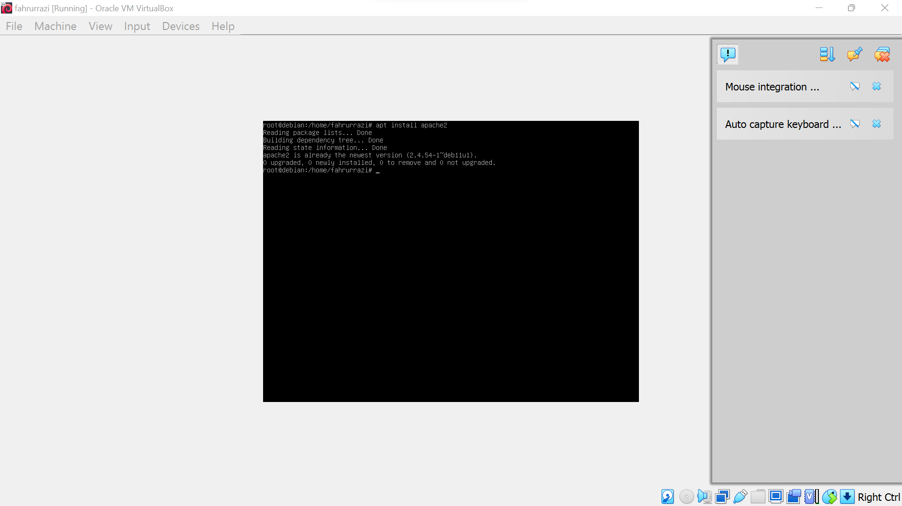
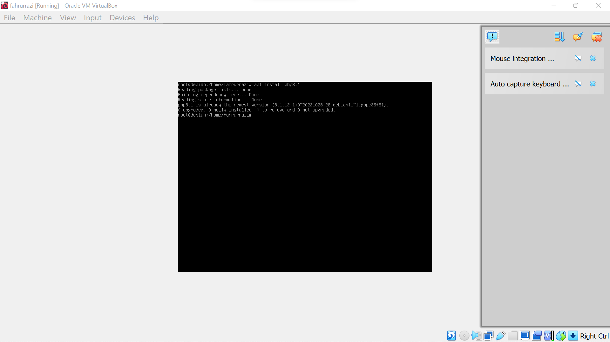
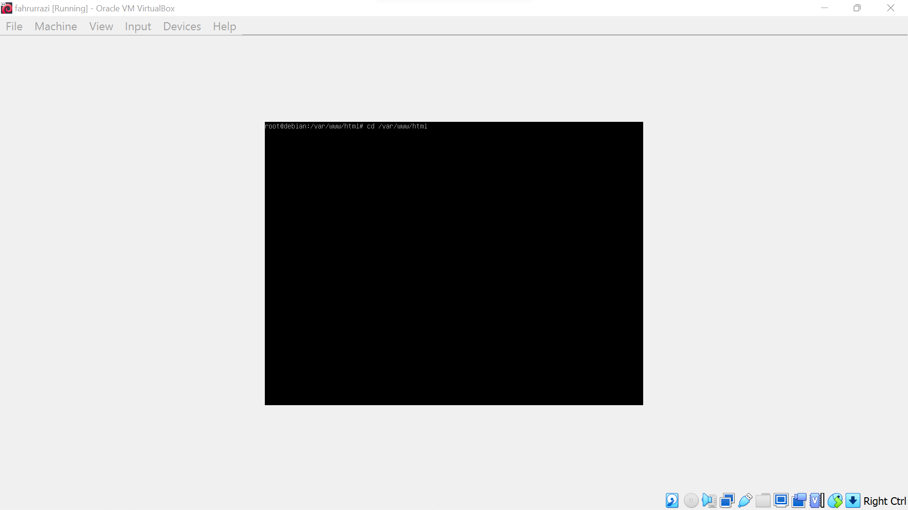
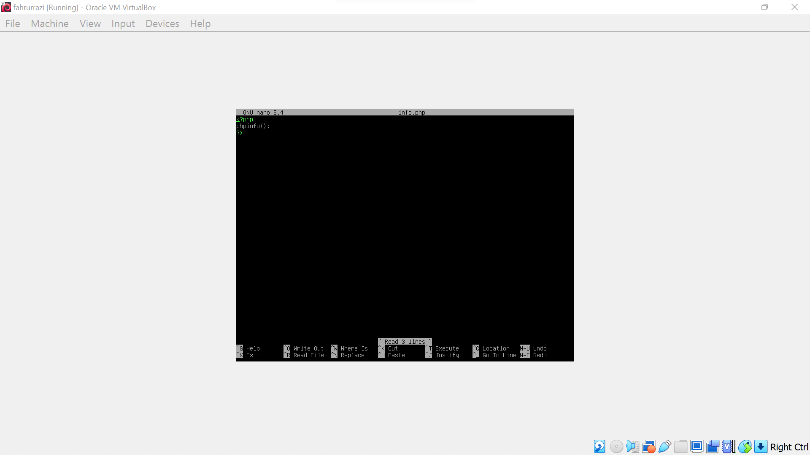
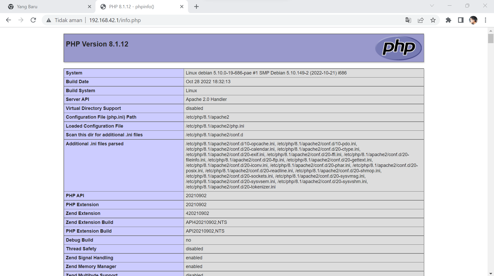

# WEB SERVER
---
## langkah-langkah nya sebagai berikut
---
## Nama Kelompok
1. Fahrurrazi 
2. Rizky Ahmad
3. Fahrul Ikhsan Hidayatullah
---
**pertama**
---
install apache2 terlebih dahulu dengan mengetikan perintah *apt install apache2* seperti pada gambar berikut :

---
**kedua**
---
setelah itu install php untuk versinya jika menggunakan versi terbaru maka kalian tinggal mencari dan menginstall php terbaru sesuai arahan pada google. 

---
**ketiga**
---
masuk ke folder html dengan mengetikan 
*cd /var/www/html*.

---
**keempat**
---
kemudian buat file php baru dengan mengetikan *nano info.php* .

---
**kelima**
---
jika sudah selesai maka isi file dengan format sebagai berikut.

---
**keenam**
---
langkah terakhir tinggal masukan no ip di ikuti nama file agar bisa melihat hasil dari file yang dibuat.

